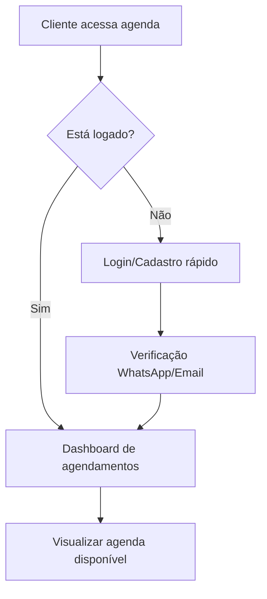
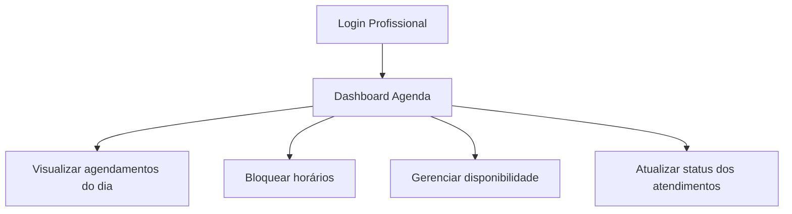
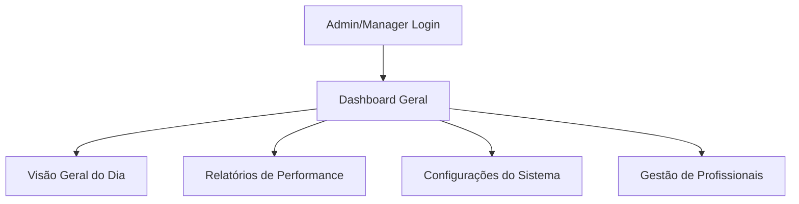
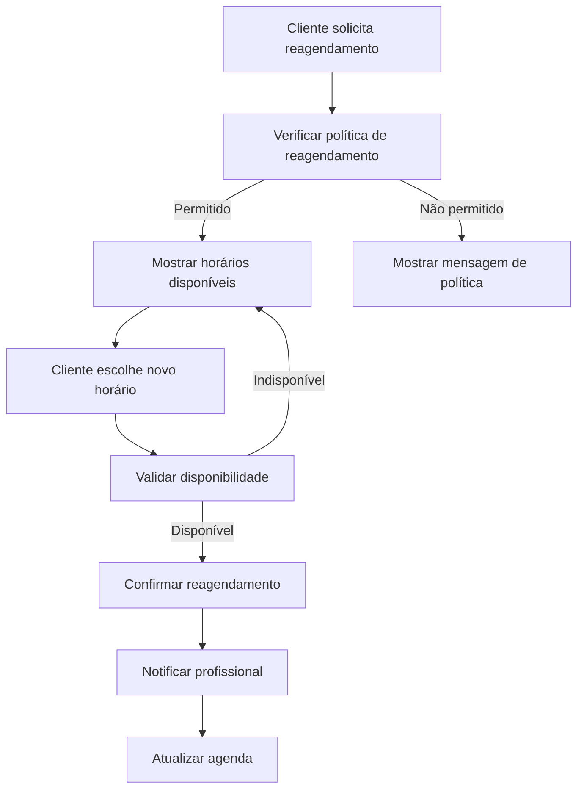

# Fluxos de Agendamento - Jornadas do Usuário

## 📋 Visão Geral

Este documento detalha os **fluxos completos de agendamento** baseados nas melhores práticas dos líderes de mercado (Trinks, OneBeleza) com otimizações específicas para o contexto de barbearias premium.

## 🎯 Princípios dos Fluxos

### **Inspiração: Trinks + OneBeleza**
- **Trinks**: Foco em conversão e fidelização
- **OneBeleza**: UX intuitiva e notificações inteligentes
- **Diferencial**: **Sem SMS automático** (redução de custos)

### **Otimizações Implementadas**
- ✅ Agendamento em **máximo 3 cliques**
- ✅ Validação de conflitos **em tempo real**
- ✅ Confirmação via **WhatsApp/Email** apenas
- ✅ Interface **mobile-first**
- ✅ **Reagendamento simplificado**

---

## 👤 Fluxo 1: Agendamento pelo Cliente

### **1.1 Acesso ao Sistema**



#### **Tela de Entrada**
- **Layout**: Calendário em destaque com horários disponíveis
- **CTA Principal**: "Agendar Horário" (botão flutuante)
- **Informações**: Profissionais disponíveis, serviços, preços
- **Filtros**: Por profissional, serviço, data

### **1.2 Seleção de Serviços**

```typescript
// Fluxo de seleção
interface SelecaoServico {
  step: 'servicos' | 'profissional' | 'horario' | 'confirmacao';
  servicos: Servico[];
  profissional?: Profissional;
  horario?: TimeSlot;
  duracao_total: number;
  valor_total: number;
}
```

#### **Passo 1: Escolha de Serviços**
- **Interface**: Cards com imagens, descrição e preço
- **Seleção Múltipla**: Checkbox para combinar serviços
- **Cálculo Automático**: Duração e valor total em tempo real
- **Sugestões**: "Clientes também escolheram..."

#### **Passo 2: Seleção de Profissional**
- **Filtro Automático**: Apenas profissionais que fazem os serviços
- **Informações**: Foto, nome, especialidades, avaliação
- **Disponibilidade**: Indicador visual de horários livres
- **Opção**: "Qualquer profissional disponível"

#### **Passo 3: Escolha de Horário**
- **Calendário Visual**: Slots disponíveis destacados
- **Views**: Semana (desktop) / Dia (mobile)
- **Tempo Real**: Atualização automática de disponibilidade
- **Sugestões**: "Horários mais próximos disponíveis"

### **1.3 Confirmação e Finalização**

```typescript
// Dados da confirmação
interface ConfirmacaoAgendamento {
  resumo: {
    servicos: string[];
    profissional: string;
    data_hora: Date;
    duracao: number;
    valor: number;
  };
  cliente: {
    nome: string;
    telefone: string;
    email: string;
  };
  observacoes?: string;
  forma_pagamento: 'dinheiro' | 'cartao' | 'pix';
}
```

#### **Tela de Confirmação**
- **Resumo Visual**: Card com todos os detalhes
- **Dados do Cliente**: Pré-preenchidos se logado
- **Observações**: Campo opcional para pedidos especiais
- **Forma de Pagamento**: Seleção para organização interna
- **Políticas**: Cancelamento, reagendamento, atraso

#### **Confirmação Final**
- **Validação**: Verificação final de disponibilidade
- **Criação**: Agendamento salvo no sistema
- **Notificação**: WhatsApp/Email de confirmação
- **Redirecionamento**: Tela de sucesso com detalhes

---

## 👨‍💼 Fluxo 2: Gestão pelo Profissional

### **2.1 Dashboard do Profissional**



#### **Interface Principal**
- **View Padrão**: Agenda do dia atual
- **Navegação**: Botões para dia anterior/próximo
- **Status Visual**: Cores diferentes por status de agendamento
- **Ações Rápidas**: Confirmar, cancelar, reagendar

### **2.2 Gerenciamento de Horários**

#### **Bloqueio de Horários**
```typescript
interface BloqueioHorario {
  tipo: 'almoco' | 'reuniao' | 'folga' | 'manutencao';
  data_inicio: Date;
  data_fim: Date;
  recorrente?: {
    frequencia: 'diaria' | 'semanal' | 'mensal';
    dias_semana?: number[];
    data_limite?: Date;
  };
  motivo?: string;
}
```

- **Tipos de Bloqueio**: Almoço, reunião, folga, manutenção
- **Recorrência**: Opção para bloqueios repetitivos
- **Visualização**: Bloqueios aparecem como eventos no calendário
- **Edição**: Arrastar para redimensionar, clique para editar

#### **Configuração de Disponibilidade**
- **Horário de Trabalho**: Início e fim por dia da semana
- **Intervalos**: Pausas automáticas entre atendimentos
- **Serviços**: Quais serviços o profissional oferece
- **Duração Personalizada**: Tempo específico por serviço

### **2.3 Atendimento e Status**

#### **Durante o Atendimento**
- **Check-in**: Marcar início do atendimento
- **Observações**: Adicionar notas sobre o serviço
- **Produtos Utilizados**: Registrar consumo de produtos
- **Check-out**: Finalizar e marcar como concluído

#### **Gestão de Status**
```typescript
enum StatusAgendamento {
  PENDENTE = 'pendente',        // Aguardando confirmação
  CONFIRMADO = 'confirmado',    // Cliente confirmou presença
  EM_ANDAMENTO = 'em_andamento', // Atendimento iniciado
  CONCLUIDO = 'concluido',      // Atendimento finalizado
  CANCELADO = 'cancelado',      // Cancelado por qualquer motivo
  NAO_COMPARECEU = 'nao_compareceu', // No-show
  REAGENDADO = 'reagendado'     // Transferido para outro horário
}
```

---

## 🏢 Fluxo 3: Administração e Gestão

### **3.1 Dashboard Administrativo**



#### **Visão Geral**
- **Métricas do Dia**: Agendamentos, receita, taxa de ocupação
- **Calendário Consolidado**: Todos os profissionais em uma view
- **Alertas**: Conflitos, cancelamentos, no-shows
- **Ações Rápidas**: Criar agendamento, bloquear horário

### **3.2 Gestão de Agendamentos**

#### **Criação Manual**
- **Busca de Cliente**: Por nome, telefone ou email
- **Seleção Rápida**: Serviços e profissionais favoritos
- **Validação Automática**: Conflitos e disponibilidade
- **Observações**: Notas internas e do cliente

#### **Operações em Massa**
```typescript
interface AcaoMassa {
  agendamentos: string[];
  acao: 'cancelar' | 'reagendar' | 'confirmar' | 'notificar';
  parametros?: {
    nova_data?: Date;
    motivo?: string;
    template_notificacao?: string;
  };
}
```

- **Seleção Múltipla**: Checkbox nos agendamentos
- **Ações Disponíveis**: Cancelar, reagendar, confirmar, notificar
- **Confirmação**: Modal com resumo das ações
- **Log de Atividades**: Registro de todas as alterações

### **3.3 Relatórios e Analytics**

#### **Métricas de Performance**
```typescript
interface MetricasAgenda {
  periodo: DateRange;
  dados: {
    total_agendamentos: number;
    taxa_ocupacao: number;
    receita_total: number;
    ticket_medio: number;
    taxa_cancelamento: number;
    taxa_no_show: number;
    horarios_pico: TimeSlot[];
    servicos_populares: ServicoMetrica[];
    profissionais_performance: ProfissionalMetrica[];
  };
}
```

#### **Relatórios Disponíveis**
- **Ocupação por Profissional**: Taxa de utilização dos horários
- **Serviços Mais Agendados**: Ranking de popularidade
- **Horários de Pico**: Análise de demanda por período
- **Taxa de Conversão**: Agendamentos vs cancelamentos
- **Receita por Período**: Faturamento detalhado

---

## 📱 Fluxo 4: Experiência Mobile

### **4.1 Otimizações Mobile**

#### **Interface Adaptada**
- **View Padrão**: Agenda do dia (mais adequada para tela pequena)
- **Navegação**: Swipe para mudar de dia
- **Eventos**: Cards expandidos com mais informações
- **FAB**: Botão flutuante para novo agendamento

#### **Gestos de Toque**
```typescript
interface GestosMobile {
  swipe_horizontal: 'navegar_dias';
  swipe_vertical: 'scroll_horarios';
  tap: 'selecionar_evento';
  long_press: 'menu_contexto';
  pinch: 'zoom_calendario';
  pull_to_refresh: 'atualizar_dados';
}
```

### **4.2 Notificações Push**

#### **Tipos de Notificação**
```typescript
interface NotificacaoPush {
  tipo: 'confirmacao' | 'lembrete' | 'cancelamento' | 'reagendamento';
  agendamento_id: string;
  titulo: string;
  mensagem: string;
  acao?: {
    label: string;
    deep_link: string;
  };
  agendamento?: Date;
}
```

#### **Cronograma de Notificações**
- **Confirmação**: Imediatamente após agendamento
- **Lembrete 24h**: 1 dia antes do agendamento
- **Lembrete 2h**: 2 horas antes do agendamento
- **Cancelamento**: Imediatamente quando cancelado
- **Reagendamento**: Quando nova data é definida

---

## 🔄 Fluxo 5: Reagendamento e Cancelamento

### **5.1 Reagendamento pelo Cliente**



#### **Políticas de Reagendamento**
```typescript
interface PoliticaReagendamento {
  antecedencia_minima: number; // horas
  limite_reagendamentos: number; // por agendamento
  taxa_reagendamento?: number; // valor em reais
  horario_limite?: string; // ex: "18:00"
  dias_permitidos?: number[]; // 0-6 (dom-sab)
}
```

### **5.2 Cancelamento**

#### **Fluxo de Cancelamento**
- **Acesso**: Link no email/WhatsApp ou área do cliente
- **Confirmação**: Modal com política de cancelamento
- **Motivo**: Seleção opcional do motivo
- **Processamento**: Liberação automática do horário
- **Notificação**: Confirmação para cliente e profissional

#### **Políticas de Cancelamento**
```typescript
interface PoliticaCancelamento {
  antecedencia_minima: number; // horas
  taxa_cancelamento?: {
    valor: number;
    antecedencia_limite: number; // horas
  };
  reembolso?: {
    percentual: number;
    prazo_dias: number;
  };
}
```

---

## 🔔 Fluxo 6: Notificações e Comunicação

### **6.1 Sistema de Notificações**

#### **Canais de Comunicação**
- ✅ **WhatsApp**: Canal principal (API Business)
- ✅ **Email**: Backup e confirmações formais
- ❌ **SMS**: Removido para reduzir custos
- ✅ **Push**: Para app mobile

#### **Templates de Mensagem**

```typescript
// WhatsApp Templates
const whatsappTemplates = {
  confirmacao: `
🎉 *Agendamento Confirmado!*

📅 Data: {{data}}
🕐 Horário: {{horario}}
💇‍♂️ Profissional: {{profissional}}
✂️ Serviços: {{servicos}}
💰 Valor: {{valor}}

📍 Endereço: {{endereco}}

Para reagendar ou cancelar: {{link}}
  `,
  
  lembrete_24h: `
⏰ *Lembrete de Agendamento*

Olá {{cliente}}! Seu horário é amanhã:

📅 {{data}} às {{horario}}
💇‍♂️ Com {{profissional}}
✂️ {{servicos}}

Confirme sua presença: {{link_confirmacao}}
Precisa reagendar? {{link_reagendamento}}
  `,
  
  lembrete_2h: `
🔔 *Seu horário é em 2 horas!*

📅 Hoje às {{horario}}
💇‍♂️ Com {{profissional}}
📍 {{endereco}}

Nos vemos em breve! 😊
  `,
};
```

### **6.2 Automações Inteligentes**

#### **Triggers Automáticos**
```typescript
interface AutomacaoNotificacao {
  evento: 'agendamento_criado' | 'agendamento_alterado' | 'lembrete_24h' | 'lembrete_2h';
  condicoes?: {
    status?: StatusAgendamento[];
    antecedencia_minima?: number;
    primeira_vez?: boolean;
  };
  acoes: {
    whatsapp?: boolean;
    email?: boolean;
    push?: boolean;
    delay?: number; // minutos
  };
}
```

#### **Personalizações**
- **Horário de Envio**: Respeitar horário comercial
- **Frequência**: Evitar spam com cooldown
- **Preferências**: Cliente pode escolher canais
- **Segmentação**: Mensagens diferentes por tipo de cliente

---

## 📊 Fluxo 7: Métricas e Otimização

### **7.1 Tracking de Conversão**

#### **Funil de Agendamento**
```typescript
interface FunilAgendamento {
  etapas: {
    visualizacao_agenda: number;
    selecao_servico: number;
    selecao_profissional: number;
    selecao_horario: number;
    preenchimento_dados: number;
    confirmacao_final: number;
  };
  taxa_conversao: number;
  pontos_abandono: string[];
}
```

#### **Métricas de UX**
- **Tempo por Etapa**: Duração média em cada passo
- **Taxa de Abandono**: Onde os usuários desistem
- **Dispositivo**: Performance mobile vs desktop
- **Horário**: Quando mais agendamentos são feitos

### **7.2 Otimização Contínua**

#### **A/B Tests**
- **Layout**: Diferentes disposições de elementos
- **CTAs**: Textos e cores de botões
- **Fluxo**: Ordem das etapas de agendamento
- **Notificações**: Templates e horários de envio

#### **Feedback Loop**
```typescript
interface FeedbackSistema {
  origem: 'cliente' | 'profissional' | 'admin';
  tipo: 'bug' | 'sugestao' | 'elogio' | 'reclamacao';
  categoria: 'interface' | 'performance' | 'funcionalidade';
  descricao: string;
  prioridade: 'baixa' | 'media' | 'alta' | 'critica';
  status: 'aberto' | 'em_analise' | 'resolvido' | 'rejeitado';
}
```

---

## 🎯 Resumo dos Diferenciais

### **Vs. Trinks**
- ✅ **Sem SMS**: Redução de custos operacionais
- ✅ **UX Simplificada**: Menos cliques para agendar
- ✅ **Mobile-First**: Interface otimizada para celular

### **Vs. OneBeleza**
- ✅ **Especialização**: Foco específico em barbearias
- ✅ **Integração**: Sistema unificado com gestão
- ✅ **Performance**: Carregamento mais rápido

### **Inovações Próprias**
- 🚀 **Reagendamento Inteligente**: Sugestões automáticas
- 🚀 **Validação em Tempo Real**: Zero conflitos
- 🚀 **Analytics Avançado**: Insights de negócio
- 🚀 **Tema Dark Premium**: Identidade visual única

---

**Próximo**: [Especificação de Componentes](./COMPONENTES.md)