# 📋 MÓDULO DE ASSINATURAS - SISTEMA TRATO

**Versão:** v2.1.0  
**Data:** 26/08/2025  
**Status:** 🔄 **EM DESENVOLVIMENTO** - Base de dados criada, integrações pendentes

---

## 📊 ÍNDICE NAVEGÁVEL

1. [Status da Implementação](#1-status-da-implementação)
2. [Plano de Tarefas - Checklist](#2-plano-de-tarefas---checklist)
3. [Arquitetura ASAAS](#3-arquitetura-asaas)
4. [Modelagem de Dados](#4-modelagem-de-dados)
5. [Integração ASAAS](#5-integração-asaas)
6. [Server Actions](#6-server-actions)
7. [Webhooks ASAAS](#7-webhooks-asaas)
8. [Interface do Usuário](#8-interface-do-usuário)
9. [Estados e Fluxos](#9-estados-e-fluxos)
10. [Segurança](#10-segurança)
11. [Testes](#11-testes)

---

## 1. STATUS DA IMPLEMENTAÇÃO

### 1.1 ✅ **CONCLUÍDO:**

**Base de Dados:**

- ✅ Migração executada com sucesso
- ✅ Tabelas criadas: `subscription_plans`, `plan_services`, `subscriptions`, `subscription_usages`, `subscription_payments`
- ✅ Índices de performance aplicados
- ✅ Triggers para `updated_at` funcionando
- ✅ RLS policies configuradas

**Frontend Base:**

- ✅ Página `/assinaturas` estruturada
- ✅ Componentes principais: `AssinaturasContent`, `SubscriptionMetrics`
- ✅ Diálogos: `CreatePlanDialog`, `CreateSubscriptionDialog`
- ✅ Tipos TypeScript completos
- ✅ Schemas Zod para validação

### 1.2 ✅ **IMPLEMENTADO:**

**Integrações:**

- ✅ Client ASAAS para API calls - IMPLEMENTADO
- ✅ Webhooks ASAAS para sincronização - TOTALMENTE IMPLEMENTADO
- ✅ Server Actions completas - IMPLEMENTADAS
- ✅ Interface avançada de criação de planos - IMPLEMENTADO
- 🔄 Sistema de uso de serviços por plano

### 1.3 ❌ **PENDENTE:**

**Funcionalidades Avançadas:**

- ❌ Fluxo completo de criação via ASAAS
- ❌ Reconciliação de pagamentos
- ❌ Dashboard de uso por cliente
- ❌ Notificações automáticas

---

## 2. PLANO DE TAREFAS - CHECKLIST

### **FASE 1 - ESTRUTURA BASE** ✅ **CONCLUÍDA**

- [x] ✅ **DB01** - Criar migração das tabelas de assinaturas
- [x] ✅ **DB02** - Aplicar índices de performance
- [x] ✅ **DB03** - Configurar RLS policies
- [x] ✅ **DB04** - Criar triggers de auditoria
- [x] ✅ **UI01** - Página principal de assinaturas
- [x] ✅ **UI02** - Componentes de listagem (tabs)
- [x] ✅ **UI03** - KPIs e métricas visuais

### **FASE 2 - INTEGRAÇÃO ASAAS** ✅ **BASE IMPLEMENTADA**

#### 2.1 Cliente ASAAS

- [x] ✅ **ASAAS01** - Criar client ASAAS com configuração de ambiente ✅ **IMPLEMENTADO**
  - [x] Configurar variáveis de ambiente (ASAAS_API_KEY, ASAAS_BASE_URL, ASAAS_ENV)
  - [x] Implementar classe AsaasClient com métodos base
  - [x] Adicionar tratamento de erros e retry
  - [x] Validar autenticação via access_token
  - [x] Configurar webhook token validation
- [x] ✅ **ASAAS02** - Implementar operações de Customer ✅ **IMPLEMENTADO**
  - [x] createCustomer() - POST /v3/customers
  - [x] getCustomer() - GET /v3/customers/:id
  - [x] updateCustomer() - POST /v3/customers/:id
  - [x] listCustomers() - GET /v3/customers com filtros
  - [x] deleteCustomer() - DELETE /v3/customers/:id
  - [x] Mapear dados Cliente Trato → Customer ASAAS
  - [x] findOrCreateCustomer() - método utilitário
  - [x] Busca inteligente por CPF/CNPJ e email

#### 2.2 Assinaturas ASAAS

- [x] ✅ **ASAAS03** - Implementar operações de Subscription ✅ **IMPLEMENTADO**
  - [x] createSubscription() - POST /v3/subscriptions
  - [x] getSubscription() - GET /v3/subscriptions/:id
  - [x] updateSubscription() - POST /v3/subscriptions/:id
  - [x] cancelSubscription() - DELETE /v3/subscriptions/:id
  - [x] getSubscriptionPayments() - GET /v3/subscriptions/:id/payments

- [x] ✅ **ASAAS04** - Implementar operações de Payment ✅ **IMPLEMENTADO**
  - [x] getPayment() - GET /v3/payments/:id
  - [x] updatePayment() - POST /v3/payments/:id
  - [x] deletePayment() - DELETE /v3/payments/:id
  - [x] Confirmar pagamento externo - POST /v3/payments/:id/receiveInCash
  - [x] listPayments() - GET /v3/payments com filtros
  - [x] generatePixQrCode() - GET /v3/payments/:id/pixQrCode
  - [x] getPaymentStatus() - GET /v3/payments/:id

#### 2.3 Server Actions

- [x] ✅ **SA01** - Criar Server Action: createSubscriptionPlan ✅ **IMPLEMENTADO**
  - [x] Validação Zod dos dados de entrada
  - [x] Inserção em subscription_plans
  - [x] Inserção em plan_services (serviços inclusos)
  - [x] Invalidar React Query cache
- [x] ✅ **SA02** - Criar Server Action: createSubscriptionASAAS ✅ **IMPLEMENTADO**
  - [x] Verificar/criar cliente no ASAAS
  - [x] Criar assinatura no ASAAS
  - [x] Salvar dados locais (subscriptions + subscription_payments)
  - [x] Retornar link de pagamento
  - [x] Integração completa com ASAAS API
- [ ] 📋 **SA03** - Criar Server Action: createSubscriptionExternal
  - [ ] Criar assinatura local (EXTERNAL)
  - [ ] Suporte a PIX e CASH
  - [ ] Confirmar pagamento imediato (opcional)
  - [ ] Definir vencimento (+30 dias)
- [ ] 📋 **SA04** - Criar Server Actions complementares
  - [ ] updateSubscription() - editar assinatura existente
  - [ ] cancelSubscription() - cancelar local + ASAAS
  - [ ] confirmExternalPayment() - marcar pagamento externo
  - [ ] getSubscriptionMetrics() - KPIs para dashboard

#### 2.4 Sistema de Uso de Serviços

- [ ] 📋 **USE01** - Implementar controle de uso
  - [ ] Server Action: recordServiceUsage()
  - [ ] Verificação de limites mensais
  - [ ] Bloqueio quando exceder limite
  - [ ] Dashboard de uso por cliente
- [ ] 📋 **USE02** - Integração com agendamentos
  - [ ] Hook no sistema de agendamentos
  - [ ] Decrementar uso ao confirmar atendimento
  - [ ] Alertas de limite próximo do fim

### **FASE 3 - WEBHOOKS E SINCRONIZAÇÃO** ✅ **CONCLUÍDA**

#### 3.1 Webhook ASAAS

- [x] ✅ **WH01** - Criar endpoint de webhook ✅ **IMPLEMENTADO**
  - [x] Route: POST /api/asaas/webhook
  - [x] Validação do token (asaas-access-token)
  - [x] Sistema de idempotência (tabela asaas_webhook_events)
  - [x] Processamento assíncrono com fila
  - [x] Resposta rápida 200 OK
  - [x] Error handling e logging
- [x] ✅ **WH02** - Processar eventos de pagamento ✅ **IMPLEMENTADO**
  - [x] PAYMENT_CREATED → criar registro local
  - [x] PAYMENT_CONFIRMED → atualizar status para CONFIRMED
  - [x] PAYMENT_RECEIVED → status RECEIVED + renovar ciclo
  - [x] PAYMENT_OVERDUE → marcar atraso
  - [x] PAYMENT_REFUNDED → processar estorno
  - [x] PAYMENT_CHARGEBACK → suspender assinatura
- [x] ✅ **WH03** - Processar eventos de assinatura ✅ **IMPLEMENTADO**
  - [x] SUBSCRIPTION_CREATED → sincronizar dados
  - [x] SUBSCRIPTION_UPDATED → atualizar local
  - [x] SUBSCRIPTION_CANCELLED → cancelar local
  - [x] SUBSCRIPTION_RENEWED → processar renovação

#### 3.2 Reconciliação

- [ ] 📋 **REC01** - Sistema de reconciliação
  - [ ] Cronjob diário de reconciliação
  - [ ] Comparar dados ASAAS vs. local
  - [ ] Relatório de divergências
  - [ ] Correção automática de inconsistências

### **FASE 4 - UX/UI AVANÇADA** ✅ **INTERFACES PRINCIPAIS CONCLUÍDAS**

#### 4.1 Interface de Planos

- [x] ✅ **UI04** - Melhorar criação de planos ✅ **IMPLEMENTADO**
  - [x] Seletor de serviços com limites
  - [x] Preview do plano antes de salvar
  - [x] Validação em tempo real
  - [x] Duplicação de planos existentes
  - [x] Interface moderna com Autocomplete
  - [x] Cards de preview interativo

#### 4.2 Interface de Assinaturas

- [x] ✅ **UI05** - Modal "Nova Assinatura" completo ✅ **IMPLEMENTADO**
  - [x] Seleção de cliente (autocomplete)
  - [x] Seleção de plano com preview
  - [x] Escolha: Link ASAAS vs. Externo
  - [x] Fluxo PIX: gerar QR code
  - [x] Fluxo Cartão: formulário seguro
  - [x] Stepper com 3 etapas (Plano & Cliente, Pagamento, Confirmação)
  - [x] Interface moderna com preview de dados
- [x] ✅ **UI06** - Tabela de assinantes avançada ✅ **IMPLEMENTADO**
  - [x] Filtros por status, forma de pagamento
  - [x] Busca por nome/email/CPF
  - [x] Ações em massa (cancelar, renovar)
  - [x] Exportação para Excel/CSV
  - [x] Seleção múltipla com checkboxes
  - [x] Cards de resumo com métricas
  - [x] Toolbar avançada com filtros

#### 4.3 Dashboard de Uso

- [ ] 📋 **UI07** - Dashboard de uso por cliente
  - [ ] Gráfico de uso mensal por serviço
  - [ ] Alertas de limite próximo
  - [ ] Histórico de usos
  - [ ] Projeção de uso futuro

### **FASE 5 - TESTES E VALIDAÇÃO** 📋 **PLANEJADA**

#### 5.1 Testes E2E

- [ ] 📋 **TEST01** - Cenários principais
  - [ ] Criar plano com 2 serviços
  - [ ] Criar assinatura ASAAS
  - [ ] Criar assinatura externa
  - [ ] Simular webhook de pagamento
  - [ ] Testar limite de uso

#### 5.2 Testes de Integração

- [ ] 📋 **TEST02** - Integração ASAAS
  - [ ] Ambiente Sandbox configurado
  - [ ] Todos os endpoints testados
  - [ ] Webhooks funcionais
  - [ ] Tratamento de erros

### **FASE 6 - OBSERVABILIDADE** 📋 **PLANEJADA**

- [ ] 📋 **OBS01** - Logs e monitoramento
  - [ ] Sentry para erros de integração
  - [ ] Logs estruturados para debugging
  - [ ] Alertas de falhas de webhook
  - [ ] Dashboard de saúde da integração

---

## 3. ARQUITETURA ASAAS

### 3.1 Ambientes e Configuração

**URLs Base:**

```typescript
const ASAAS_CONFIG = {
  production: {
    baseURL: 'https://api.asaas.com/v3',
    webhookURL: 'https://trato.com/api/asaas/webhook',
  },
  sandbox: {
    baseURL: 'https://api-sandbox.asaas.com/v3',
    webhookURL: 'https://trato.dev/api/asaas/webhook',
  },
};
```

**Variáveis de Ambiente:**

```bash
# ASAAS Configuration
ASAAS_API_KEY=your_api_key_here
ASAAS_BASE_URL=https://api-sandbox.asaas.com/v3
ASAAS_ENV=sandbox # sandbox | production
ASAAS_WEBHOOK_TOKEN=your_webhook_secret

# Webhook Validation
ASAAS_WEBHOOK_URL=https://yourdomain.com/api/asaas/webhook
```

### 3.2 Client ASAAS

```typescript
// lib/asaas/client.ts
export class AsaasClient {
  private baseURL: string;
  private apiKey: string;

  constructor() {
    this.baseURL = process.env.ASAAS_BASE_URL!;
    this.apiKey = process.env.ASAAS_API_KEY!;
  }

  private async request<T>(endpoint: string, options?: RequestInit): Promise<T> {
    const response = await fetch(`${this.baseURL}${endpoint}`, {
      ...options,
      headers: {
        'Content-Type': 'application/json',
        access_token: this.apiKey,
        ...options?.headers,
      },
    });

    if (!response.ok) {
      throw new AsaasError(response.status, await response.text());
    }

    return response.json();
  }

  // Customer operations
  async createCustomer(data: CreateCustomerRequest): Promise<AsaasCustomer> {
    return this.request('/customers', {
      method: 'POST',
      body: JSON.stringify(data),
    });
  }

  // Subscription operations
  async createSubscription(data: CreateSubscriptionRequest): Promise<AsaasSubscription> {
    return this.request('/subscriptions', {
      method: 'POST',
      body: JSON.stringify(data),
    });
  }

  async getSubscriptionPayments(subscriptionId: string): Promise<AsaasPayment[]> {
    const response = await this.request<{ data: AsaasPayment[] }>(
      `/subscriptions/${subscriptionId}/payments`,
    );
    return response.data;
  }
}
```

### 3.3 Mapeamentos de Dados

**Cliente Trato → Customer ASAAS:**

```typescript
const mapClienteToAsaasCustomer = (cliente: Cliente): CreateCustomerRequest => ({
  name: cliente.nome,
  email: cliente.email,
  mobilePhone: cliente.telefone,
  cpfCnpj: cliente.cpf,
  postalCode: cliente.cep,
  address: cliente.endereco,
  addressNumber: cliente.numero,
  complement: cliente.complemento,
  province: cliente.bairro,
  city: cliente.cidade,
  state: cliente.estado,
  externalReference: cliente.id, // ID do cliente no Trato
});
```

**Plano Trato → Subscription ASAAS:**

```typescript
const mapPlanToAsaasSubscription = (
  plan: SubscriptionPlan,
  customerId: string,
): CreateSubscriptionRequest => ({
  customer: customerId,
  billingType: 'PIX', // PIX, CREDIT_CARD, BOLETO
  value: plan.price_cents / 100, // Converter de cents para reais
  nextDueDate: new Date(Date.now() + 30 * 24 * 60 * 60 * 1000).toISOString().split('T')[0],
  cycle: plan.billing_cycle.toUpperCase(), // MONTHLY, QUARTERLY, YEARLY
  description: `${plan.name} - ${plan.description}`,
  externalReference: plan.id, // ID do plano no Trato
});
```

---

## 4. MODELAGEM DE DADOS

### 4.1 Status das Tabelas ✅ **CRIADAS**

**Tabelas Implementadas:**

- ✅ `subscription_plans` - Planos de assinatura
- ✅ `plan_services` - Serviços inclusos nos planos
- ✅ `subscriptions` - Assinaturas dos clientes
- ✅ `subscription_usages` - Controle de uso dos serviços
- ✅ `subscription_payments` - Histórico de pagamentos

### 4.2 Estados e Transições

**Status de Assinatura:**

```typescript
type SubscriptionStatus =
  | 'AWAITING_PAYMENT' // Aguardando primeiro pagamento
  | 'ACTIVE' // Ativa e em dia
  | 'PAST_DUE' // Atrasada (tolerância)
  | 'SUSPENDED' // Suspensa por falta de pagamento
  | 'CANCELED'; // Cancelada
```

**Status de Pagamento:**

```typescript
type PaymentStatus =
  | 'PENDING' // Aguardando pagamento
  | 'CONFIRMED' // Confirmado (mas não recebido)
  | 'RECEIVED' // Recebido pelo ASAAS
  | 'OVERDUE' // Vencido
  | 'REFUNDED' // Estornado
  | 'CHARGEBACK'; // Chargeback
```

### 4.3 Queries Essenciais

**KPIs para Dashboard:**

```sql
-- Total de assinaturas ativas
SELECT COUNT(*) as active_subscriptions
FROM subscriptions s
WHERE s.status = 'ACTIVE'
  AND s.cancelled_at IS NULL
  AND s.unidade_id = current_unidade_id();

-- Receita mensal recorrente (MRR)
SELECT SUM(sp.price_cents) / 100 as mrr
FROM subscriptions s
JOIN subscription_plans sp ON sp.id = s.plan_id
WHERE s.status IN ('ACTIVE', 'PAST_DUE')
  AND s.cancelled_at IS NULL
  AND sp.billing_cycle = 'monthly'
  AND s.unidade_id = current_unidade_id();

-- Taxa de churn mensal
WITH canceled_this_month AS (
  SELECT COUNT(*) as canceled
  FROM subscriptions
  WHERE DATE_TRUNC('month', cancelled_at) = DATE_TRUNC('month', CURRENT_DATE)
    AND unidade_id = current_unidade_id()
),
active_start_month AS (
  SELECT COUNT(*) as active
  FROM subscriptions
  WHERE status IN ('ACTIVE', 'PAST_DUE', 'SUSPENDED')
    AND created_at < DATE_TRUNC('month', CURRENT_DATE)
    AND unidade_id = current_unidade_id()
)
SELECT
  c.canceled,
  a.active,
  CASE WHEN a.active > 0 THEN (c.canceled::float / a.active * 100) ELSE 0 END as churn_rate
FROM canceled_this_month c, active_start_month a;
```

---

## 5. INTEGRAÇÃO ASAAS

### 5.1 Fluxo de Criação de Assinatura

**1. Assinatura Link ASAAS:**


**2. Assinatura Externa (PIX/Cash):**


### 5.2 Server Actions Principais

```typescript
// actions/subscriptions.ts
export async function createSubscriptionASAAS(data: CreateSubscriptionASAASData) {
  'use server';

  try {
    // 1. Validar dados
    const validatedData = CreateSubscriptionSchema.parse(data);

    // 2. Buscar cliente e plano
    const cliente = await getCliente(validatedData.customerId);
    const plan = await getSubscriptionPlan(validatedData.planId);

    // 3. Criar/buscar customer no ASAAS
    let asaasCustomerId = cliente.asaas_customer_id;
    if (!asaasCustomerId) {
      const asaasCustomer = await asaasClient.createCustomer(mapClienteToAsaasCustomer(cliente));
      asaasCustomerId = asaasCustomer.id;

      // Salvar ID do customer
      await updateClienteAsaasId(cliente.id, asaasCustomerId);
    }

    // 4. Criar assinatura no ASAAS
    const asaasSubscription = await asaasClient.createSubscription({
      customer: asaasCustomerId,
      billingType: validatedData.billingType,
      value: plan.price_cents / 100,
      nextDueDate: validatedData.nextDueDate,
      cycle: plan.billing_cycle.toUpperCase(),
      description: `${plan.name} - ${plan.description}`,
    });

    // 5. Salvar dados locais
    const subscription = await createSubscription({
      plan_id: plan.id,
      customer_id: cliente.id,
      unidade_id: cliente.unidade_id,
      asaas_customer_id: asaasCustomerId,
      asaas_subscription_id: asaasSubscription.id,
      status: 'AWAITING_PAYMENT',
      payment_method: 'LINK_ASAAS',
      current_cycle_due_date: validatedData.nextDueDate,
    });

    // 6. Criar primeiro pagamento
    await createSubscriptionPayment({
      subscription_id: subscription.id,
      amount_cents: plan.price_cents,
      method: 'LINK_ASAAS',
      status: 'PENDING',
      due_date: validatedData.nextDueDate,
      asaas_payment_id: asaasSubscription.id, // O ASAAS cria payment automaticamente
    });

    // 7. Invalidar cache
    revalidateTag('subscriptions');
    revalidateTag('subscription-metrics');

    return {
      success: true,
      data: {
        subscription,
        paymentLink: asaasSubscription.invoiceUrl, // Link de pagamento
      },
    };
  } catch (error) {
    console.error('Erro ao criar assinatura ASAAS:', error);
    return {
      success: false,
      error: error instanceof Error ? error.message : 'Erro desconhecido',
    };
  }
}

export async function createSubscriptionExternal(data: CreateSubscriptionExternalData) {
  'use server';

  try {
    // 1. Validar dados
    const validatedData = CreateSubscriptionExternalSchema.parse(data);

    // 2. Buscar cliente e plano
    const cliente = await getCliente(validatedData.customerId);
    const plan = await getSubscriptionPlan(validatedData.planId);

    // 3. Calcular próximo vencimento (+30 dias)
    const nextDueDate = new Date();
    nextDueDate.setDate(nextDueDate.getDate() + 30);

    // 4. Criar assinatura local
    const subscription = await createSubscription({
      plan_id: plan.id,
      customer_id: cliente.id,
      unidade_id: cliente.unidade_id,
      status: validatedData.confirmPayment ? 'ACTIVE' : 'AWAITING_PAYMENT',
      payment_method: 'EXTERNAL',
      external_method: validatedData.externalMethod, // PIX ou CASH
      current_cycle_due_date: nextDueDate,
      last_payment_confirmed_at: validatedData.confirmPayment ? new Date() : null,
    });

    // 5. Criar pagamento
    await createSubscriptionPayment({
      subscription_id: subscription.id,
      amount_cents: plan.price_cents,
      method: validatedData.externalMethod,
      status: validatedData.confirmPayment ? 'CONFIRMED' : 'PENDING',
      due_date: nextDueDate,
      paid_at: validatedData.confirmPayment ? new Date() : null,
    });

    // 6. Invalidar cache
    revalidateTag('subscriptions');
    revalidateTag('subscription-metrics');

    return {
      success: true,
      data: { subscription },
    };
  } catch (error) {
    console.error('Erro ao criar assinatura externa:', error);
    return {
      success: false,
      error: error instanceof Error ? error.message : 'Erro desconhecido',
    };
  }
}
```

---

## 6. SERVER ACTIONS

### 6.1 Estrutura Base

```typescript
// actions/subscriptions.ts - Estrutura completa
export async function createSubscriptionPlan(data: CreatePlanData) {
  /* ... */
}
export async function updateSubscriptionPlan(id: string, data: UpdatePlanData) {
  /* ... */
}
export async function deleteSubscriptionPlan(id: string) {
  /* ... */
}

export async function createSubscriptionASAAS(data: CreateSubscriptionASAASData) {
  /* ... */
}
export async function createSubscriptionExternal(data: CreateSubscriptionExternalData) {
  /* ... */
}
export async function updateSubscription(id: string, data: UpdateSubscriptionData) {
  /* ... */
}
export async function cancelSubscription(id: string) {
  /* ... */
}

export async function confirmExternalPayment(subscriptionId: string) {
  /* ... */
}
export async function getSubscriptionMetrics(unidadeId: string) {
  /* ... */
}
export async function getSubscriptions(filters: SubscriptionFilters) {
  /* ... */
}

export async function recordServiceUsage(data: ServiceUsageData) {
  /* ... */
}
export async function getSubscriptionUsage(subscriptionId: string) {
  /* ... */
}
```

### 6.2 Validação e Segurança

**Schemas Zod:**

```typescript
// schemas/subscription.ts - Adições necessárias
export const CreateSubscriptionASAASSchema = z.object({
  customerId: z.string().uuid(),
  planId: z.string().uuid(),
  billingType: z.enum(['PIX', 'CREDIT_CARD', 'BOLETO']),
  nextDueDate: z.string().date(),
  autoRenew: z.boolean().default(true),
});

export const CreateSubscriptionExternalSchema = z.object({
  customerId: z.string().uuid(),
  planId: z.string().uuid(),
  externalMethod: z.enum(['PIX', 'CASH']),
  confirmPayment: z.boolean().default(false),
  notes: z.string().optional(),
});

export const ServiceUsageSchema = z.object({
  subscriptionId: z.string().uuid(),
  serviceId: z.string().uuid(),
  appointmentId: z.string().uuid().optional(),
  quantity: z.number().int().positive().default(1),
});
```

---

## 7. WEBHOOKS ASAAS

### 7.1 Endpoint de Webhook

```typescript
// app/api/asaas/webhook/route.ts
export async function POST(request: Request) {
  try {
    // 1. Validar token
    const token = request.headers.get('asaas-access-token');
    if (token !== process.env.ASAAS_WEBHOOK_TOKEN) {
      return new Response('Unauthorized', { status: 401 });
    }

    // 2. Parse do payload
    const payload = await request.json();
    const webhookData = AsaasWebhookSchema.parse(payload);

    // 3. Verificar idempotência
    const existingEvent = await checkWebhookEvent(
      webhookData.payment?.id || webhookData.subscription?.id,
      webhookData.event,
    );

    if (existingEvent) {
      return new Response('OK', { status: 200 }); // Já processado
    }

    // 4. Salvar evento para idempotência
    await saveWebhookEvent({
      external_id: webhookData.payment?.id || webhookData.subscription?.id,
      event_type: webhookData.event,
      payload: webhookData,
      status: 'PENDING',
    });

    // 5. Processar assincronamente
    await processWebhookEvent(webhookData);

    return new Response('OK', { status: 200 });
  } catch (error) {
    console.error('Erro no webhook ASAAS:', error);

    // Log no Sentry
    Sentry.captureException(error, {
      tags: { component: 'asaas-webhook' },
      extra: { payload: await request.json() },
    });

    return new Response('Internal Server Error', { status: 500 });
  }
}

async function processWebhookEvent(webhookData: AsaasWebhookData) {
  switch (webhookData.event) {
    case 'PAYMENT_CONFIRMED':
      await handlePaymentConfirmed(webhookData.payment!);
      break;

    case 'PAYMENT_RECEIVED':
      await handlePaymentReceived(webhookData.payment!);
      break;

    case 'PAYMENT_OVERDUE':
      await handlePaymentOverdue(webhookData.payment!);
      break;

    case 'SUBSCRIPTION_UPDATED':
      await handleSubscriptionUpdated(webhookData.subscription!);
      break;

    case 'SUBSCRIPTION_CANCELLED':
      await handleSubscriptionCancelled(webhookData.subscription!);
      break;

    default:
      console.log(`Evento não tratado: ${webhookData.event}`);
  }
}

async function handlePaymentReceived(payment: AsaasPayment) {
  // 1. Encontrar pagamento local
  const localPayment = await getSubscriptionPaymentByAsaasId(payment.id);
  if (!localPayment) return;

  // 2. Atualizar status
  await updateSubscriptionPayment(localPayment.id, {
    status: 'RECEIVED',
    paid_at: payment.paymentDate || payment.clientPaymentDate,
  });

  // 3. Ativar assinatura e renovar ciclo
  const subscription = await getSubscription(localPayment.subscription_id);
  const nextDueDate = calculateNextDueDate(subscription, payment.paymentDate);

  await updateSubscription(subscription.id, {
    status: 'ACTIVE',
    last_payment_confirmed_at: payment.paymentDate,
    current_cycle_due_date: nextDueDate,
  });

  // 4. Invalidar cache
  revalidateTag('subscriptions');
  revalidateTag('subscription-metrics');

  // 5. Notificar cliente (opcional)
  await notifyPaymentReceived(subscription.customer_id, subscription.id);
}
```

### 7.2 Tabela de Controle de Webhooks

```sql
-- Tabela para idempotência de webhooks
CREATE TABLE asaas_webhook_events (
    id uuid PRIMARY KEY DEFAULT uuid_generate_v4(),
    external_id text NOT NULL, -- payment.id ou subscription.id
    event_type text NOT NULL,
    payload jsonb NOT NULL,
    status text NOT NULL DEFAULT 'PENDING', -- PENDING, PROCESSED, FAILED
    processed_at timestamptz,
    error_message text,
    retry_count int DEFAULT 0,
    created_at timestamptz DEFAULT now(),

    CONSTRAINT unique_event UNIQUE (external_id, event_type)
);

CREATE INDEX idx_webhook_events_status ON asaas_webhook_events(status, created_at);
CREATE INDEX idx_webhook_events_external ON asaas_webhook_events(external_id);
```

---

## 8. INTERFACE DO USUÁRIO

### 8.1 Melhorias Necessárias

**Modal "Nova Assinatura" - Fluxo Completo:**

```tsx
// components/CreateSubscriptionDialog.tsx - Versão completa
export function CreateSubscriptionDialog({ open, onClose, plans }) {
  const [step, setStep] = useState(1); // 1: Dados, 2: Pagamento, 3: Confirmação
  const [paymentMethod, setPaymentMethod] = useState<'asaas' | 'external'>('asaas');
  const [billingType, setBillingType] = useState<'PIX' | 'CREDIT_CARD' | 'BOLETO'>('PIX');

  return (
    <DSDialog open={open} onClose={onClose} maxWidth="md">
      <DialogTitle>Nova Assinatura</DialogTitle>

      <DialogContent>
        {step === 1 && (
          <Step1BasicData
            onNext={(data) => {
              setFormData(data);
              setStep(2);
            }}
            plans={plans}
          />
        )}

        {step === 2 && (
          <Step2PaymentMethod
            paymentMethod={paymentMethod}
            onPaymentMethodChange={setPaymentMethod}
            billingType={billingType}
            onBillingTypeChange={setBillingType}
            onNext={() => setStep(3)}
            onBack={() => setStep(1)}
          />
        )}

        {step === 3 && (
          <Step3Confirmation
            formData={formData}
            paymentMethod={paymentMethod}
            billingType={billingType}
            onConfirm={handleCreateSubscription}
            onBack={() => setStep(2)}
          />
        )}
      </DialogContent>
    </DSDialog>
  );
}

// Componente para seleção de método de pagamento
function Step2PaymentMethod({ paymentMethod, onPaymentMethodChange, ... }) {
  return (
    <Box>
      <Typography variant="h6" gutterBottom>
        Como o cliente vai pagar?
      </Typography>

      <RadioGroup value={paymentMethod} onChange={(e) => onPaymentMethodChange(e.target.value)}>
        <FormControlLabel
          value="asaas"
          control={<Radio />}
          label="Link de Pagamento (ASAAS)"
        />
        <FormControlLabel
          value="external"
          control={<Radio />}
          label="Pagamento Externo (PIX/Dinheiro)"
        />
      </RadioGroup>

      {paymentMethod === 'asaas' && (
        <Box sx={{ mt: 2 }}>
          <Typography variant="subtitle2" gutterBottom>
            Forma de Pagamento:
          </Typography>
          <ToggleButtonGroup
            value={billingType}
            exclusive
            onChange={(e, value) => onBillingTypeChange(value)}
          >
            <ToggleButton value="PIX">PIX</ToggleButton>
            <ToggleButton value="CREDIT_CARD">Cartão</ToggleButton>
            <ToggleButton value="BOLETO">Boleto</ToggleButton>
          </ToggleButtonGroup>
        </Box>
      )}

      {paymentMethod === 'external' && (
        <Box sx={{ mt: 2 }}>
          <Typography variant="subtitle2" gutterBottom>
            Método Externo:
          </Typography>
          <ToggleButtonGroup
            value={externalMethod}
            exclusive
            onChange={(e, value) => onExternalMethodChange(value)}
          >
            <ToggleButton value="PIX">PIX</ToggleButton>
            <ToggleButton value="CASH">Dinheiro</ToggleButton>
          </ToggleButtonGroup>

          <FormControlLabel
            control={
              <Checkbox
                checked={confirmPayment}
                onChange={(e) => setConfirmPayment(e.target.checked)}
              />
            }
            label="Confirmar pagamento imediatamente"
            sx={{ mt: 1 }}
          />
        </Box>
      )}
    </Box>
  );
}
```

### 8.2 Dashboard de Uso por Cliente

```tsx
// components/SubscriptionUsageDialog.tsx
export function SubscriptionUsageDialog({ subscription, open, onClose }) {
  const { data: usage, isLoading } = useSubscriptionUsage(subscription.id);
  const { data: planServices } = usePlanServices(subscription.plan_id);

  return (
    <DSDialog open={open} onClose={onClose} maxWidth="lg">
      <DialogTitle>Uso da Assinatura - {subscription.cliente.nome}</DialogTitle>

      <DialogContent>
        <Grid container spacing={3}>
          {/* Resumo Mensal */}
          <Grid item xs={12}>
            <Card>
              <CardHeader title="Uso no Mês Atual" />
              <CardContent>
                <Grid container spacing={2}>
                  {planServices?.map((service) => {
                    const used = usage?.find((u) => u.service_id === service.service_id)?.used || 0;
                    const allowed = service.allowed_uses_per_cycle;
                    const percentage = (used / allowed) * 100;

                    return (
                      <Grid item xs={12} sm={6} md={4} key={service.service_id}>
                        <Box>
                          <Typography variant="subtitle2">{service.servico.nome}</Typography>
                          <LinearProgress
                            variant="determinate"
                            value={Math.min(percentage, 100)}
                            color={
                              percentage > 90 ? 'error' : percentage > 70 ? 'warning' : 'primary'
                            }
                          />
                          <Typography variant="body2" color="text.secondary">
                            {used} de {allowed} usos
                          </Typography>
                        </Box>
                      </Grid>
                    );
                  })}
                </Grid>
              </CardContent>
            </Card>
          </Grid>

          {/* Histórico */}
          <Grid item xs={12}>
            <Card>
              <CardHeader title="Histórico de Uso" />
              <CardContent>
                <DSLineArea
                  data={usage?.history || []}
                  height={300}
                  label="Usos por dia"
                  valueType="number"
                />
              </CardContent>
            </Card>
          </Grid>
        </Grid>
      </DialogContent>
    </DSDialog>
  );
}
```

---

## 9. ESTADOS E FLUXOS

### 9.1 Máquina de Estados

```mermaid
stateDiagram-v2
    [*] --> AWAITING_PAYMENT: Nova assinatura criada

    AWAITING_PAYMENT --> ACTIVE: Pagamento confirmado
    AWAITING_PAYMENT --> CANCELED: Cliente cancela

    ACTIVE --> PAST_DUE: Pagamento em atraso
    ACTIVE --> SUSPENDED: Múltiplos atrasos
    ACTIVE --> CANCELED: Cliente cancela

    PAST_DUE --> ACTIVE: Pagamento efetuado
    PAST_DUE --> SUSPENDED: Atraso prolongado
    PAST_DUE --> CANCELED: Cancelamento por inadimplência

    SUSPENDED --> ACTIVE: Regularização
    SUSPENDED --> CANCELED: Cancelamento definitivo

    CANCELED --> [*]
```



### 9.2 Fluxos de Negócio

**Renovação Automática:**

```sql
-- Cronjob diário para verificar renovações
SELECT s.id, s.asaas_subscription_id, s.current_cycle_due_date
FROM subscriptions s
WHERE s.status = 'ACTIVE'
  AND s.auto_renew = true
  AND s.current_cycle_due_date <= CURRENT_DATE + INTERVAL '3 days' -- 3 dias antes
  AND s.payment_method = 'LINK_ASAAS'
  AND NOT EXISTS (
    SELECT 1 FROM subscription_payments sp
    WHERE sp.subscription_id = s.id
      AND sp.due_date > CURRENT_DATE
      AND sp.status IN ('PENDING', 'CONFIRMED')
  );
```

**Suspensão por Inadimplência:**

```sql
-- Cronjob para suspender assinaturas vencidas
UPDATE subscriptions
SET status = 'SUSPENDED',
    updated_at = now()
WHERE status IN ('ACTIVE', 'PAST_DUE')
  AND current_cycle_due_date < CURRENT_DATE - INTERVAL '7 days' -- 7 dias de tolerância
  AND NOT EXISTS (
    SELECT 1 FROM subscription_payments sp
    WHERE sp.subscription_id = subscriptions.id
      AND sp.status IN ('CONFIRMED', 'RECEIVED')
      AND sp.due_date >= current_cycle_due_date
  );
```

---

## 10. SEGURANÇA

### 10.1 RLS Policies ✅ **IMPLEMENTADAS**

**Políticas Ativas:**

```sql
-- Ver todas as policies aplicadas
SELECT schemaname, tablename, policyname, cmd, qual
FROM pg_policies
WHERE tablename LIKE 'subscription%'
ORDER BY tablename, policyname;
```

### 10.2 Validação de Webhooks

**Verificação de Assinatura:**

```typescript
// lib/asaas/webhook-validator.ts
export function validateWebhookSignature(payload: string, signature: string): boolean {
  const secret = process.env.ASAAS_WEBHOOK_SECRET;
  if (!secret) throw new Error('ASAAS_WEBHOOK_SECRET não configurado');

  const expectedSignature = crypto.createHmac('sha256', secret).update(payload).digest('hex');

  return crypto.timingSafeEqual(
    Buffer.from(signature, 'hex'),
    Buffer.from(expectedSignature, 'hex'),
  );
}

// Rate limiting para webhooks
const webhookLimiter = rateLimit({
  windowMs: 1 * 60 * 1000, // 1 minuto
  max: 100, // máximo 100 requests por minuto por IP
  message: 'Muitos webhooks em pouco tempo',
  standardHeaders: true,
  legacyHeaders: false,
});
```

---

## 11. TESTES

### 11.1 Cenários E2E Críticos

```javascript
// e2e/subscriptions.spec.ts
describe('Sistema de Assinaturas', () => {
  test('ASAAS01: Criar assinatura Link ASAAS com PIX', async ({ page }) => {
    // 1. Login como admin
    await page.goto('/login');
    await page.fill('[name="email"]', 'admin@teste.com');
    await page.fill('[name="password"]', '123456');
    await page.click('button[type="submit"]');

    // 2. Navegar para assinaturas
    await page.goto('/assinaturas');
    await expect(page.locator('h1')).toContainText('Assinaturas');

    // 3. Nova assinatura
    await page.click('button:has-text("Nova Assinatura")');

    // 4. Preencher dados
    await page.selectOption('[name="customerId"]', 'cliente-teste-uuid');
    await page.selectOption('[name="planId"]', 'plano-basico-uuid');
    await page.click('button:has-text("Próximo")');

    // 5. Escolher Link ASAAS + PIX
    await page.click('input[value="asaas"]');
    await page.click('button[value="PIX"]');
    await page.click('button:has-text("Próximo")');

    // 6. Confirmar
    await page.click('button:has-text("Criar Assinatura")');

    // 7. Verificar sucesso
    await expect(page.locator('.MuiAlert-message')).toContainText('Assinatura criada com sucesso');

    // 8. Verificar na tabela
    await page.waitForSelector('[data-testid="subscriptions-table"]');
    await expect(page.locator('table')).toContainText('Aguardando Pagamento');
    await expect(page.locator('table')).toContainText('Link ASAAS');
  });

  test('EXT01: Criar assinatura externa e confirmar pagamento', async ({ page }) => {
    await page.goto('/assinaturas');
    await page.click('button:has-text("Nova Assinatura")');

    // Dados básicos
    await page.selectOption('[name="customerId"]', 'cliente-teste-uuid');
    await page.selectOption('[name="planId"]', 'plano-premium-uuid');
    await page.click('button:has-text("Próximo")');

    // Pagamento externo
    await page.click('input[value="external"]');
    await page.click('button[value="PIX"]');
    await page.check('input[name="confirmPayment"]'); // Confirmar pagamento
    await page.click('button:has-text("Próximo")');

    // Confirmar
    await page.click('button:has-text("Criar Assinatura")');

    // Verificar status ativo
    await expect(page.locator('table')).toContainText('Ativa');
    await expect(page.locator('table')).toContainText('Externo (PIX)');
  });

  test('USE01: Verificar limite de uso de serviço', async ({ page }) => {
    // Pré-requisito: cliente com plano limitado (2 cortes/mês)
    await page.goto('/agenda');

    // Agendar 1º atendimento
    await page.click('button:has-text("Novo Agendamento")');
    await page.selectOption('[name="clienteId"]', 'cliente-com-plano-uuid');
    await page.selectOption('[name="servicoId"]', 'corte-cabelo-uuid');
    await page.click('button:has-text("Agendar")');

    // Confirmar atendimento
    await page.click('button:has-text("Confirmar Atendimento")');
    await expect(page.locator('.MuiAlert-message')).toContainText('1 de 2 usos utilizados');

    // Agendar 2º atendimento
    await page.click('button:has-text("Novo Agendamento")');
    await page.selectOption('[name="clienteId"]', 'cliente-com-plano-uuid');
    await page.selectOption('[name="servicoId"]', 'corte-cabelo-uuid');
    await page.click('button:has-text("Agendar")');

    // Confirmar 2º atendimento
    await page.click('button:has-text("Confirmar Atendimento")');
    await expect(page.locator('.MuiAlert-message')).toContainText('2 de 2 usos utilizados');

    // Tentar 3º atendimento - deve bloquear
    await page.click('button:has-text("Novo Agendamento")');
    await page.selectOption('[name="clienteId"]', 'cliente-com-plano-uuid');
    await page.selectOption('[name="servicoId"]', 'corte-cabelo-uuid');

    await expect(page.locator('.MuiAlert-error')).toContainText('Limite de usos excedido');
    await expect(page.locator('button:has-text("Agendar")')).toBeDisabled();
  });
});
```

### 11.2 Testes de Webhook

```javascript
// e2e/webhooks.spec.ts
describe('Webhooks ASAAS', () => {
  test('WH01: Processar PAYMENT_RECEIVED', async ({ request }) => {
    // 1. Criar assinatura teste
    const subscription = await createTestSubscription();

    // 2. Simular webhook
    const webhookPayload = {
      event: 'PAYMENT_RECEIVED',
      payment: {
        id: 'pay_test_123',
        subscription: subscription.asaas_subscription_id,
        value: 99.9,
        status: 'RECEIVED',
        paymentDate: new Date().toISOString(),
      },
    };

    const response = await request.post('/api/asaas/webhook', {
      data: webhookPayload,
      headers: {
        'asaas-access-token': process.env.ASAAS_WEBHOOK_TOKEN,
        'content-type': 'application/json',
      },
    });

    expect(response.status()).toBe(200);

    // 3. Verificar se assinatura foi ativada
    const updatedSubscription = await getSubscription(subscription.id);
    expect(updatedSubscription.status).toBe('ACTIVE');
    expect(updatedSubscription.last_payment_confirmed_at).toBeTruthy();
  });
});
```

---

## **📋 RESUMO DO STATUS:**

### ✅ **CONCLUÍDO (26/08/2025):**

- [x] Migração de banco de dados
- [x] Estrutura frontend básica
- [x] Tipos TypeScript e validação Zod
- [x] Layout e navegação

### 🔄 **EM DESENVOLVIMENTO:**

- [ ] Client ASAAS (40% concluído)
- [ ] Server Actions (30% concluído)
- [ ] Interface de usuário avançada (20% concluído)

### 📋 **PRÓXIMAS TAREFAS (Prioridade Alta):**

1. **ASAAS01** - Client ASAAS com configuração
2. **SA01** - Server Action: createSubscriptionPlan
3. **SA02** - Server Action: createSubscriptionASAAS
4. **UI04** - Modal "Nova Assinatura" completo

---

**🎯 OBJETIVO:** Sistema de assinaturas 100% funcional com integração ASAAS até 30/08/2025

**📋 Este documento será atualizado conforme o progresso das tarefas.**

**Responsável:** Equipe de Desenvolvimento Trato  
**Próxima Revisão:** 27/08/2025
