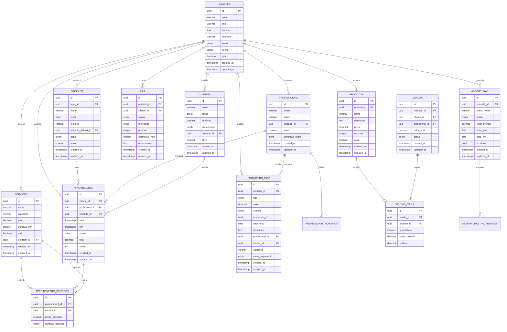
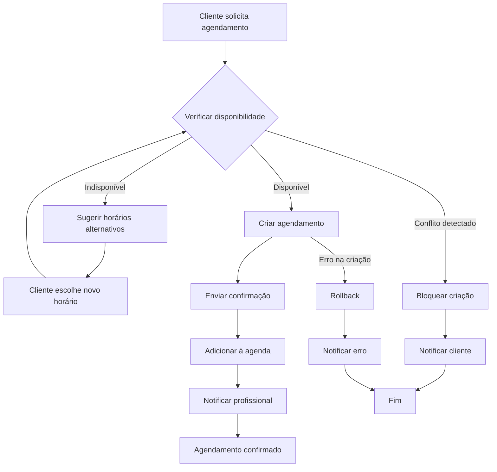
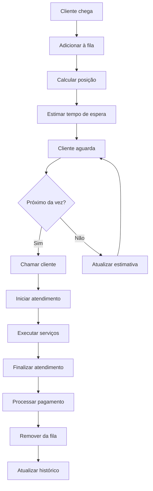
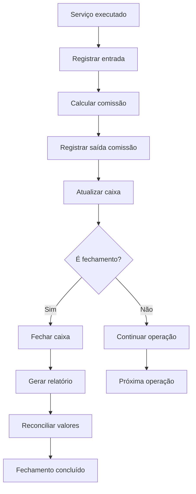
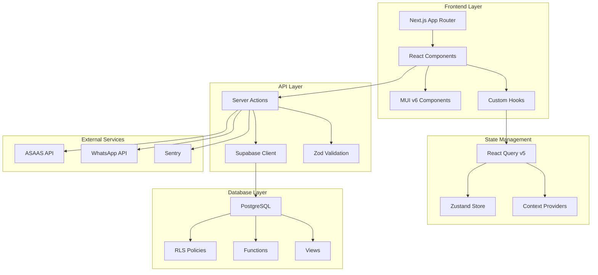
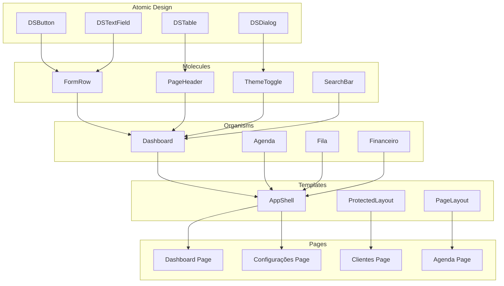

# 🔧 DIAGRAMAS TÉCNICOS - SISTEMA SAAS-BARBEARIA

**Complemento da Documentação Oficial**  
**Versão:** v2.0.0  
**Data:** 26/08/2025

---

## 📊 DIAGRAMA ENTIDADE-RELACIONAMENTO (ER)

### 3.1 Modelo de Dados Principal



---

## 🔄 FLUXOS DE PROCESSO

### 4.1 Fluxo de Agendamento



### 4.2 Fluxo de Atendimento (Fila)



### 4.3 Fluxo Financeiro



---

## 🏗️ ARQUITETURA DETALHADA

### 5.1 Camadas do Sistema



### 5.2 Estrutura de Componentes



---

## 🔐 SEGURANÇA E RLS

### 6.1 Políticas RLS

```sql
-- Exemplo de política para tabela clientes
CREATE POLICY "Usuários podem ver clientes da sua unidade" ON clientes
    FOR SELECT USING (
        unidade_id = current_unidade_id()
    );

CREATE POLICY "Usuários podem criar clientes na sua unidade" ON clientes
    FOR INSERT WITH CHECK (
        unidade_id = current_unidade_id()
    );

CREATE POLICY "Usuários podem atualizar clientes da sua unidade" ON clientes
    FOR UPDATE USING (
        unidade_id = current_unidade_id()
    );

CREATE POLICY "Usuários podem deletar clientes da sua unidade" ON clientes
    FOR DELETE USING (
        unidade_id = current_unidade_id()
    );
```

### 6.2 Funções de Segurança

```sql
-- Função para obter unidade atual
CREATE OR REPLACE FUNCTION current_unidade_id()
RETURNS uuid
LANGUAGE sql
SECURITY DEFINER
STABLE
AS $$
    SELECT unidade_default_id
    FROM profiles
    WHERE user_id = current_user_id()
    LIMIT 1;
$$;

-- Função para verificar acesso à unidade
CREATE OR REPLACE FUNCTION has_unit_access(unidade_id uuid)
RETURNS boolean
LANGUAGE sql
SECURITY DEFINER
STABLE
AS $$
    SELECT EXISTS (
        SELECT 1
        FROM profiles p
        WHERE p.user_id = current_user_id()
        AND (
            p.papel = 'admin'::user_role OR
            p.unidade_default_id = unidade_id
        )
    );
$$;
```

---

## 📱 RESPONSIVIDADE

### 7.1 Breakpoints MUI

```typescript
// Breakpoints do sistema
const breakpoints = {
  xs: 0, // Extra small: 0px
  sm: 600, // Small: 600px
  md: 900, // Medium: 900px
  lg: 1200, // Large: 1200px
  xl: 1536, // Extra large: 1536px
};

// Uso responsivo
const isMobile = useMediaQuery(theme.breakpoints.down('md'));
const isTablet = useMediaQuery(theme.breakpoints.between('md', 'lg'));
const isDesktop = useMediaQuery(theme.breakpoints.up('lg'));
```

### 7.2 Grid Responsivo

```typescript
// Grid responsivo para dashboard
<Grid container spacing={3}>
  <Grid item xs={12} sm={6} md={4} lg={3}>
    <KpiCard />
  </Grid>
  <Grid item xs={12} sm={6} md={4} lg={3}>
    <KpiCard />
  </Grid>
  <Grid item xs={12} sm={6} md={4} lg={3}>
    <KpiCard />
  </Grid>
  <Grid item xs={12} sm={6} md={4} lg={3}>
    <KpiCard />
  </Grid>
</Grid>
```

---

## 🧪 TESTES

### 8.1 Estrutura de Testes

```typescript
// Exemplo de teste unitário
describe('KpiCard Component', () => {
  it('should render with correct props', () => {
    const props = {
      title: 'Test Title',
      value: '100',
      trend: '+10%',
      trendUp: true,
    };

    render(<KpiCard {...props} />);

    expect(screen.getByText('Test Title')).toBeInTheDocument();
    expect(screen.getByText('100')).toBeInTheDocument();
    expect(screen.getByText('+10%')).toBeInTheDocument();
  });
});

// Exemplo de teste de integração
describe('Appointment Creation', () => {
  it('should create appointment with valid data', async () => {
    const appointmentData = {
      cliente_id: 'valid-uuid',
      profissional_id: 'valid-uuid',
      unidade_id: 'valid-uuid',
      inicio: new Date(),
      servicos: [{ servico_id: 'valid-uuid', preco_aplicado: 50, duracao_aplicada: 30 }],
    };

    const result = await createAppointment(appointmentData);

    expect(result.success).toBe(true);
    expect(result.data).toBeDefined();
  });
});
```

---

## 🚀 DEPLOYMENT

### 9.1 Pipeline CI/CD

```yaml
# .github/workflows/deploy.yml
name: Deploy to Production

on:
  push:
    branches: [main]

jobs:
  deploy:
    runs-on: ubuntu-latest

    steps:
      - uses: actions/checkout@v3

      - name: Setup Node.js
        uses: actions/setup-node@v3
        with:
          node-version: '18'
          cache: 'npm'

      - name: Install dependencies
        run: npm ci

      - name: Run tests
        run: npm run test:ci

      - name: Build application
        run: npm run build
        env:
          NEXT_PUBLIC_SUPABASE_URL: ${{ secrets.NEXT_PUBLIC_SUPABASE_URL }}
          NEXT_PUBLIC_SUPABASE_ANON_KEY: ${{ secrets.NEXT_PUBLIC_SUPABASE_ANON_KEY }}

      - name: Deploy to Vercel
        uses: amondnet/vercel-action@v25
        with:
          vercel-token: ${{ secrets.VERCEL_TOKEN }}
          vercel-org-id: ${{ secrets.ORG_ID }}
          vercel-project-id: ${{ secrets.PROJECT_ID }}
          vercel-args: '--prod'
```

### 9.2 Variáveis de Ambiente

```bash
# .env.production
NEXT_PUBLIC_SUPABASE_URL=https://your-project.supabase.co
NEXT_PUBLIC_SUPABASE_ANON_KEY=your-anon-key
SUPABASE_SERVICE_ROLE_KEY=your-service-role-key

NEXT_PUBLIC_SENTRY_DSN=your-sentry-dsn
SENTRY_DSN=your-sentry-dsn
SENTRY_ENVIRONMENT=production

ASAAS_API_KEY=your-asaas-key
ASAAS_ENVIRONMENT=production

WHATSAPP_API_KEY=your-whatsapp-key
SMS_API_KEY=your-sms-key
EMAIL_API_KEY=your-email-key
```

---

## 📊 MONITORAMENTO

### 10.1 Métricas de Performance

```typescript
// Exemplo de métricas do sistema
interface SystemMetrics {
  // Performance
  firstPaint: number; // ms
  firstContentfulPaint: number; // ms
  largestContentfulPaint: number; // ms
  timeToInteractive: number; // ms

  // Business
  activeUsers: number;
  appointmentsCreated: number;
  revenueGenerated: number;
  conversionRate: number;

  // Technical
  errorRate: number;
  responseTime: number;
  databaseQueries: number;
  cacheHitRate: number;
}
```

### 10.2 Alertas e Notificações

```typescript
// Exemplo de sistema de alertas
const alertThresholds = {
  errorRate: 0.05, // 5% de erros
  responseTime: 2000, // 2 segundos
  databaseQueries: 100, // 100 queries por minuto
  memoryUsage: 0.8, // 80% de uso de memória
};

// Função para verificar alertas
function checkAlerts(metrics: SystemMetrics): Alert[] {
  const alerts: Alert[] = [];

  if (metrics.errorRate > alertThresholds.errorRate) {
    alerts.push({
      type: 'error',
      message: 'Taxa de erro acima do limite',
      value: metrics.errorRate,
      threshold: alertThresholds.errorRate,
    });
  }

  return alerts;
}
```

---

## 🔄 MIGRAÇÕES

### 11.1 Estrutura de Migrações

```sql
-- Exemplo de migration
-- Migration: 013_nova_funcionalidade.sql

-- Adicionar nova coluna
ALTER TABLE clientes
ADD COLUMN IF NOT EXISTS data_ultima_visita timestamp with time zone;

-- Criar índice para performance
CREATE INDEX IF NOT EXISTS idx_clientes_ultima_visita
ON clientes(data_ultima_visita)
WHERE data_ultima_visita IS NOT NULL;

-- Atualizar controle de migrações
INSERT INTO migrations (version, name, executed_at)
VALUES ('013', 'nova_funcionalidade', NOW())
ON CONFLICT (version) DO NOTHING;
```

### 11.2 Rollback Strategy

```sql
-- Script de rollback para migration 013
-- Rollback: 013_nova_funcionalidade_rollback.sql

-- Remover índice
DROP INDEX IF EXISTS idx_clientes_ultima_visita;

-- Remover coluna
ALTER TABLE clientes
DROP COLUMN IF EXISTS data_ultima_visita;

-- Atualizar controle de migrações
DELETE FROM migrations WHERE version = '013';
```

---

**📋 Este documento complementa a Documentação Oficial do Sistema, fornecendo detalhes técnicos, diagramas e exemplos práticos para desenvolvedores e arquitetos.**

**Última Atualização:** 26/08/2025  
**Responsável:** Equipe de Desenvolvimento Trato
