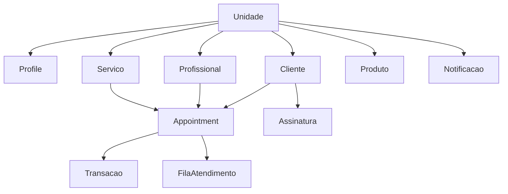

# 📋 DOCUMENTAÇÃO: CONTRATOS & TIPOS (FASE 3)

> **Documento:** Contratos e Tipos Centralizados - Sistema SaaS Barbearia  
> **Data:** Dezembro 2024  
> **Fase:** 3 - Contratos & Tipos  
> **Status:** ✅ CONCLUÍDO

## 🎯 VISÃO GERAL

Esta fase implementou a centralização completa de todos os tipos TypeScript e schemas de validação Zod para o sistema SaaS Barbearia, criando um contrato de dados unificado e consistente em toda a aplicação.

## 📁 ARQUIVOS IMPLEMENTADOS

### 1. `src/types/api.ts` - Tipos Centralizados da API

**Finalidade:** Definições TypeScript para todas as entidades do sistema  
**Linhas:** 650+ linhas  
**Entidades cobertas:** 12 entidades principais + tipos utilitários

#### 🏢 Entidades Principais:

- **Unidade** - Sistema de franquias/filiais
- **Profile** - Usuários e permissões
- **Cliente** - Gestão de clientes
- **Profissional** - Gestão de profissionais
- **Serviço** - Catálogo de serviços
- **Appointment** - Sistema de agendamentos
- **FilaAtendimento** - Queue management
- **Transacao** - Sistema financeiro
- **Produto** - Gestão de estoque
- **Assinatura** - Sistema de recorrência
- **Notificacao** - Sistema de alertas

#### 🔧 Tipos Utilitários:

```typescript
// Tipos de resposta padronizados
(ApiResponse<T>, PaginatedResponse<T>, ApiError);

// Tipos base
(EntityId, TimestampString, BaseEntity, UnidadeBasedEntity);

// Tipos de paginação e busca
(PaginationParams, SearchParams);
```

#### 📝 Padrões Implementados:

- **CRUD Types:** Create/Update DTOs para cada entidade
- **Filter Types:** Filtros específicos para listagens
- **Response Types:** Padronização de respostas da API
- **Status Enums:** Enumerações para estados das entidades

### 2. `src/schemas/api.ts` - Validação Zod

**Finalidade:** Schemas de validação correspondentes aos tipos TypeScript  
**Linhas:** 650+ linhas  
**Coverage:** 100% dos tipos definidos na API

#### 🛡️ Schemas de Validação:

```typescript
// Exemplo de schema completo
export const ClienteSchema = z.object({
  id: EntityIdSchema,
  nome: z.string().min(2).max(100),
  email: z.string().email().optional(),
  telefone: z.string().optional(),
  data_nascimento: z.string().date().optional(),
  cpf: z.string().optional(),
  endereco: z.string().max(255).optional(),
  observacoes: z.string().max(500).optional(),
  ativo: z.boolean(),
  unidade_id: EntityIdSchema,
  created_at: TimestampSchema,
  updated_at: TimestampSchema,
});

// Schemas derivados
export const CreateClienteSchema = z.object({...});
export const UpdateClienteSchema = CreateClienteSchema.omit({...}).partial();
export const ClienteFiltersSchema = z.object({...});
```

#### 🔍 Validações Implementadas:

- **UUID Validation:** IDs com formato UUID obrigatório
- **String Lengths:** Limites mínimos e máximos para textos
- **Email Format:** Validação de formato de email
- **Date Format:** Validação de datas e timestamps
- **Number Ranges:** Validação de valores numéricos (preços, comissões)
- **Enum Validation:** Validação de status e tipos enumerados

### 3. `src/types/index.ts` - Barrel Export

**Finalidade:** Ponto único de exportação para todos os tipos  
**Benefícios:** Imports limpos e organizados

```typescript
// Re-export centralizado dos tipos da API
export * from './api';

// Re-export seletivo do marketplace (evitando conflitos)
export type {
  MarketplaceServico,
  ReservaMarketplace,
  // ... outros tipos específicos
} from './marketplace';

// Tipos próprios do sistema de actions
export interface ActionResult<T = unknown> {
  success: boolean;
  data?: T;
  error?: string;
  message?: string;
  errors?: ValidationError[];
}
```

## 🎯 BENEFÍCIOS IMPLEMENTADOS

### ✅ 1. Consistência de Dados

- **Single Source of Truth:** Todas as entidades definidas em um local
- **Type Safety:** Validação em tempo de compilação e runtime
- **Schema Validation:** Validação automática de entrada de dados

### ✅ 2. Manutenibilidade

- **Imports Limpos:** `import { Cliente, CreateClienteSchema } from '@/types'`
- **Refatoração Segura:** Mudanças propagadas automaticamente
- **Documentação Inline:** JSDoc em tipos críticos

### ✅ 3. Developer Experience

- **IntelliSense Completo:** Auto-complete em toda a aplicação
- **Error Prevention:** Catch de erros em tempo de desenvolvimento
- **Runtime Validation:** Validação automática com Zod

### ✅ 4. Padrões Unificados

- **CRUD Consistency:** Padrões uniformes para todas entidades
- **API Contracts:** Contratos bem definidos entre frontend/backend
- **Error Handling:** Estrutura padronizada de erros

## 🔧 ESTRUTURA DE DADOS PRINCIPAL

### 🏢 Entidades Core



### 📊 Tipos de Status

```typescript
// Status dos agendamentos
type StatusAgendamento =
  | 'agendado'
  | 'confirmado'
  | 'em_andamento'
  | 'concluido'
  | 'cancelado'
  | 'nao_compareceu';

// Status financeiro
type StatusTransacao = 'pendente' | 'pago' | 'cancelado' | 'estornado';

// Formas de pagamento
type FormaPagamento = 'dinheiro' | 'cartao_credito' | 'cartao_debito' | 'pix' | 'transferencia';
```

## 📋 CHECKLIST DE IMPLEMENTAÇÃO

### ✅ Fase 3.1 - Tipos da API

- [x] Definição de interfaces para todas entidades
- [x] DTOs de criação e atualização
- [x] Tipos de filtros para listagens
- [x] Tipos de resposta padronizados
- [x] Enums para status e estados

### ✅ Fase 3.2 - Schemas Zod

- [x] Schemas de validação para todas entidades
- [x] Validação de formato (UUID, email, data)
- [x] Validação de ranges (string length, números)
- [x] Schemas derivados (Create, Update, Filters)
- [x] Tipos inferidos dos schemas

### ✅ Fase 3.3 - Barrel Exports

- [x] Configuração de re-exports centralizados
- [x] Resolução de conflitos entre módulos
- [x] Imports limpos e organizados
- [x] Manutenção de tipos legados

### ✅ Fase 3.4 - Documentação

- [x] Documentação completa da estrutura
- [x] Exemplos de uso dos tipos
- [x] Padrões e convenções estabelecidas
- [x] Guia de manutenção

### 🔄 Fase 3.5 - Próximos Passos

- [ ] Atualização de server actions para usar tipos centralizados
- [ ] Migração de componentes para novos tipos
- [ ] Testes de integração com tipos
- [ ] Validação em formulários

## 🚀 PRÓXIMOS PASSOS

### 1. Integração com Server Actions

```typescript
// Exemplo de server action tipado
export async function createCliente(data: CreateClienteDTO): Promise<ActionResult<Cliente>> {
  try {
    // Validação automática com Zod
    const validatedData = CreateClienteSchema.parse(data);

    // Lógica de criação...

    return { success: true, data: newCliente };
  } catch (error) {
    return { success: false, error: error.message };
  }
}
```

### 2. Componentes Tipados

```typescript
// Hook tipado para clientes
export function useClientes(filters?: ClienteFilters) {
  return useQuery<PaginatedResponse<Cliente>>({
    queryKey: ['clientes', filters],
    queryFn: () => getClientes(filters),
  });
}
```

### 3. Formulários Validados

```typescript
// Formulário com validação automática
const form = useForm<CreateClienteDTO>({
  resolver: zodResolver(CreateClienteSchema),
  defaultValues: {
    nome: '',
    ativo: true,
    unidade_id: currentUnidade.id,
  },
});
```

## 🎉 CONCLUSÃO

A **Fase 3 - Contratos & Tipos** foi concluída com sucesso, estabelecendo uma base sólida de tipos TypeScript e validação Zod para todo o sistema. Isso garante:

- **Type Safety** em toda a aplicação
- **Validação consistente** de dados
- **Developer Experience** melhorada
- **Manutenibilidade** a longo prazo

A próxima etapa será a integração desses tipos com os server actions e componentes existentes, migrando gradualmente todo o sistema para usar essa nova estrutura tipada.

---

**Documentação gerada automaticamente - Fase 3 completa** ✅
